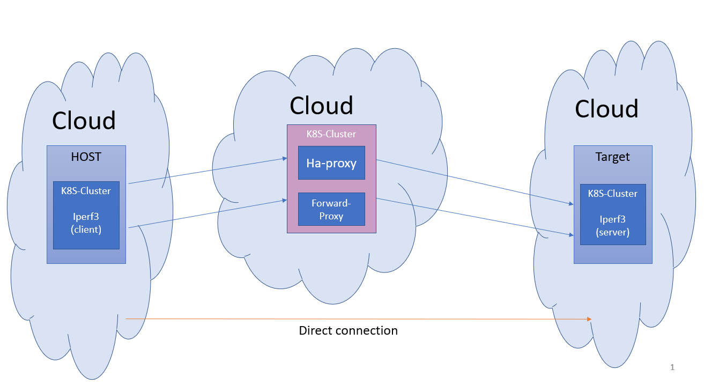

# K8S Cloud Routing Project
Network measurement tool for checking throughput and latency between different regions in different clouds platforms.
The script creates K8S clusters(Host,target) in different regions and performs iperf3 tests.
the iperf3 test has 3 types of flavors:
- **Direct** - Direct test between host to target.
- **TCP Splitting**-  Test between host to target via proxy server.  
                The proxy server split the tcp connection using Haproxy.
- **TCP Forwarding**- Test between host to target via proxy server.
                   The proxy server forward the tcp traffic using iptables rules.

## Supported cloud platforms 
Currently the following platforms are supported:

|     | IBM CLOUD | Google Cloud Platform (GCP) | Amazon Web Services (AWS) | Microsoft Azure |
| --- | --- | --- | --- |  --- |
| Host Cluster | V | V | V | TODO |
| Target Cluster | V | V | V | TODO |
| Proxy Cluster| V | V | TODO | TODO|
### Folders Description
The project folders are:
- **forwarding proxy** - Contain docker and YAMLs files to create forwarding proxy image, K8S deployment and LoadBalancer.  
- **Haproxy**          - Contain docker and YAMLs files to create custom Haproxy image, K8S deployment and LoadBalancer.  
- **iperf3**           - Contain YAMLs files to create Iperf3 server deployment,Iperf3 client and LoadBalancer.  
- **project_metadata** - contain metadata.json -(save all meta data for each test (Clusters, Regions, Platforms, IPs etc.))
                         and api functions to update the meta_data.  
- **ReadMe**           - Contain files for project README.
- **Steps**            - Contain scripts for each step of the test: 
    - Cluster create 
    - Cluster setup 
    - Test Run
    - Cluster delete
- **test**             - Contains the following files/folders: 
    - script folder- test files that call all the necessary steps for each test(create, set, run, delete).
    - Examples -Example tests using script files from the script folder
    - Cloud_Regions folder - contains JSON files with the region prefix for each platform.

## Environment setup
Before running a test, do the following preparations:

- Check you are login to all th relevant cloud platforms:
    - IBM: ``` ibmcloud login  --apikey @ <apikey.json> ```
    - GCP: ```  gcloud auth login ;```  ``` gcloud auth configure-docker ```
    - AWS: ```  aws configure ```
- Update the steps/PROJECT_PARAMS.py file according to your cloud setting:
    - GCP: update GOOGLE_PROJECT_ID
    - IBM: update container namespace IBM_NAMESPACE
## How to run a test?
To run a test you need to do the following steps: 

- **Create K8S clusters:** 
    - Create HOST K8S cluster using ```steps/create_k8s_cluster.py```
    - Create TARGET K8S cluster using ```steps/create_k8s_cluster.py```
    - Create PROXY K8S cluster using ```steps/create_k8s_cluster.py``` 
- **Set K8S clusters:**
    - Set iperf3 client on HOST cluster using ```steps/set_k8s_cluster.py```
    - Set iperf3 server on TARGET cluster using ```steps/set_k8s_cluster.py```
    - Set Haproxy container and forwarding proxy on PROXY cluster using ```steps/set_k8s_cluster.py```
- **Run ipef3 test** :
    - To run just iperf3 test between HOST to TARGET use ```steps/run_k8s_baseline_test.py```
    - To run iperf3 test between HOST to TARGET via  PROXY (forwarding proxy and splitting proxy(HAPROXY)) use  ```steps/run_k8s_baseline_test.py``` 
- **Delete ipef3 test** : Delete all clusters using ```steps/delete_k8s_cluster.py```

Example of Test scripts that contain all those steps can be find in ```test/scripts``` folder.
- For example ```test/scripts/single_test.py ``` andd running command:
    ```sh
    python3 tests/scripts/single_test.py  -h_zone us-east1 -h_platform gcp -p_zone us-central1 -p_platform gcp -t_zone us-west1 -t_platform ibm
    ```
- Additional tests examples that use  ```test/scripts/Examples``` can be found in ```test``` folder. 
- The single Test can be run also using Jupyter notebook:     ```sh
   Single Test- (host, proxy,target).ipynb```
## Thanks
This platform is using the following tools:
- Iperf3 tool   (version: iperf3 3.9)
- Haproxy Load Balancer (version:latest)
- Ubuntu docker image (version:latest).

Special thanks to the maintainers and developers of those tools.
