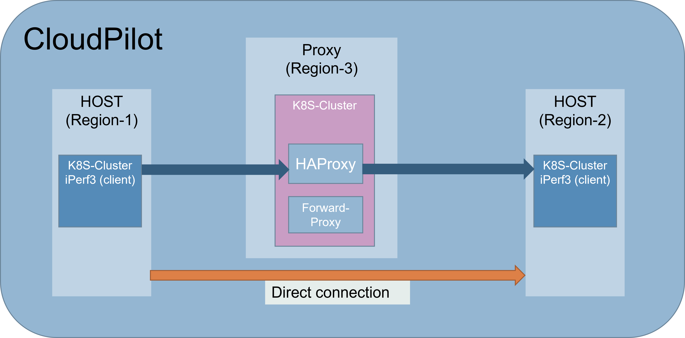
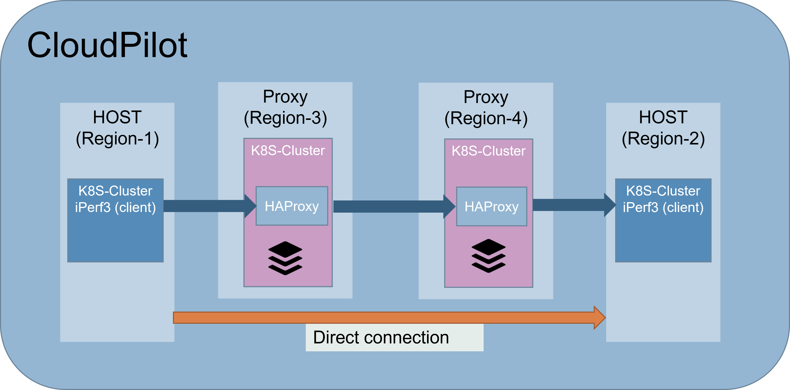

# CloudPilot Project
This git contain the components for CloudPilot Project.
1) Cloud proxy acceleration:
    This component can create one proxy or two-proxy acceleration for destination IP.  
    In addition, the system can create network measurement for checking throughput and latency between different regions in different cloud platforms.  
    The test creates K8S clusters(Host,target) in different regions and performs iPerf3 tests.  
    The iPerf3 test has four types of flavors:
    - **Direct connection ** - Direct connection test between host to target.
    - **TCP Forwarding**- Test between host to target via proxy server.
                   The proxy server forward the TCP traffic using iptables rules.
                   
    - **one proxy acceleration**- Test between host to target via one TCP splitting proxy.  
                The proxy server split the TCP connection using HAProxy.
    
    
    
    - **Two proxy acceleration**- Test between host to target via two TCP splitting proxies.  
                The proxies split the TCP connection using HAProxy.
                
    
2) Cloud proxy allocation Algorithms:
This component contains simulation and algorithms for choosing the best proxies location.  
There are five different algorithms: Flow greedy FCT, Flow greedy cost, one proxy greedy, two proxy greedy
and two proxy greedy with RollBack.  
With those algorithms, you can find the best location for placing proxies acceleration that can be done 
with the first component.  

## Supported cloud platforms 
Currently the following platforms are supported:

|     | IBM CLOUD | Google Cloud Platform (GCP) | Amazon Web Services (AWS) | Microsoft Azure |
| --- | --- | --- | --- |  --- |
| Host Cluster | V | V | V | TODO |
| Target Cluster | V | V | V | TODO |
| Proxy Cluster| V | V | TODO | TODO|
### Folders Description
The project folders are:
- **Forwarding proxy** - Contain docker and YAMLs files to create forwarding proxy image, K8S deployment and LoadBalancer.  
- **HAProxy**          - Contain docker and YAMLs files to create custom HAProxy image, K8S deployment and LoadBalancer.  
- **iPerf3**           - Contain YAMLs files to create iPerf3 server deployment,iPerf3 client and LoadBalancer.  
- **project_metadata** - contain metadata.json -(save all metadata for each test (Clusters, Regions, Platforms, IPs etc.))
                         and api functions to update the metadata.  
- **ReadMe**           - Contain files for project README.
- **Steps**            - Contain scripts for each step of the test: 
    - Cluster create 
    - Cluster setup 
    - Test Run
    - Cluster delete
- **test**             - Contains the following files/folders: 
    - script folder- test files that call all the necessary steps for each test(create, set, run, delete).
    - Examples -Example tests using script files from the script folder
    - Cloud_Regions folder - contains JSON files with the region prefix for each platform.

## Environment setup
Before running a test, do the following preparations:

- Check you are login to all the relevant cloud platforms:
    - IBM: ``` ibmcloud login  --apikey @ <apikey.json> ```
    - GCP: ```  gcloud auth login ;```  ``` gcloud auth configure-docker ```
    - AWS: ```  aws configure ```
- Update the steps/PROJECT_PARAMS.py file according to your cloud setting:
    - GCP: update GOOGLE_PROJECT_ID
    - IBM: update container namespace IBM_NAMESPACE

## How to run a test and create cloud proxies
To run a network measurement test you need to do the following steps: 
- **Create K8S clusters:** 
    - Create HOST K8S cluster using ```steps/create_k8s_cluster.py```
    - Create TARGET K8S cluster using ```steps/create_k8s_cluster.py```
    - Create PROXY K8S cluster using ```steps/create_k8s_cluster.py``` 
- **Set K8S clusters:**
    - Set iPerf3 client on HOST cluster using ```steps/set_k8s_cluster.py```
    - Set iPerf3 server on TARGET cluster using ```steps/set_k8s_cluster.py```
    - Set HAProxy container and forwarding proxy on PROXY cluster using ```steps/set_k8s_cluster.py```
- **Run ipef3 test** :
    - To run just iPerf3 test between HOST to TARGET use ```steps/run_k8s_baseline_test.py```
    - To run iPerf3 test between HOST to TARGET via  PROXY (forwarding proxy and splitting proxy(HAPROXY)) use  ```steps/run_k8s_baseline_test.py``` 
- **Delete iPerf3 test** : Delete all clusters using ```steps/delete_k8s_cluster.py```

There are four types of operation can be done with cloud proxy acceleration:
1) One proxy-acceleration test:
    This test create K8S cluster for host,target and proxy.
    The test run a iPerf3 test between the host and target via acceleration proxy.
    Before running the test please update the regions and cloud providers of the host, target and proxy
    in the file ```test/scripts/single_test_one_proxy_acceleration.py ```.
    To run the test run the command:  
    ```python3 tests/scripts/single_test_one_proxy_acceleration.py```

2) Two proxy-acceleration test:
    This test create K8S cluster for host,target and two proxies.
    The test run a iPerf3 test between the host and target via two acceleration proxy.
    Before running the test please update the regions and cloud providers of the host, target and proxies
    in the file ```test/scripts/single_test_two_proxy_acceleration.py ```.
    To run the test run the command:  
    ```python3 tests/scripts/single_test_two_proxy_acceleration.py```

3) Creating one proxy-acceleration :
   This component create K8S cluster proxy acceleration for given destination IP. 
    Before running the component please update the region and cloud provider of the proxy
    in the file ```test/scripts/one_proxy_acceleration.py ```.
    To run the test run the command:  
    ```python3 tests/scripts/one_proxy_acceleration.py```

4) Creating two proxy-acceleration :
   This component create two K8S cluster proxies for acceleration for a given  destination IP. 
    Before running the component please update the regions and cloud provider of the proxies
    in the file ```test/scripts/two_proxy_acceleration.py ```.
    To run the test run the command:  
    ```python3 tests/scripts/two_proxy_acceleration.py```
- Additional tests examples that use  ```test/scripts/Examples``` can be found in ```test``` folder. 

## How to run prediction algorithm
This simulation calculates the proxies' locations for given servers' couples locations.  
To run the prediction algorithm simulation please update the file ```algorithms/tests/cloud_proxy_prediction/cloud_proxy_prediction.py ```
with the following parameters:
- Algorithm name
- Budget
- Cloud provider for proxies
- Servers locations and RTT from the closest cloud region
- Servers couples (source and destination)
To run the algorithm prediction simulation please run the file  ```algorithms/tests/cloud_proxy_prediction/cliud_proxy_prediction.py ```  
More details can be found in the file.
## How to run algorithms simulation
This component contain simulation for the five algorithms for proxy placement routing:  
Flow greedy FCT, Flow greedy cost, one proxy greedy, two proxy greedy
and two proxy greedy with RollBack.  
There are four use cases for simulation: one-to-many,many-to-many,many one-to-one an many one-to-many.  
To run the algorithm simulation is recommended to use python IDE like PyCharm.  
1) One-to-many - to run simulation for use case one-to-many please run 
  the file ```algorithms/tests/Example_one_to_many_simulation_test.py ```  
  More details can be found in the file.
2) Many-to-many - to run simulation for use case many-to-many please run 
  the file ```algorithms/tests/Example_many_to_many_simulation_test.py ```  
  More details can be found in the file.
3) Many one-to-one - to run simulation for use case many one-to-one please run 
  the file ```algorithms/tests/Example_many_one_to_one_simulation_test.py ```  
  More details can be found in the file.
4) Many one-to-many (localized CDN) - to run simulation for use case many one-to-one please run 
  the file ```algorithms/tests/Example_localized_cdn_simulation_test.py ```  
  More details can be found in the file.

## Thanks
This platform is using the following tools:
- iPerf3 tool   (version: iPerf3 3.9)
- HAProxy Load Balancer (version:latest)
- Ubuntu docker image (version:latest).
- Kubernetes (version:latest).

Special thanks to the maintainers and developers of those tools.
